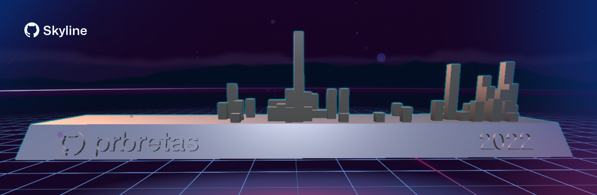
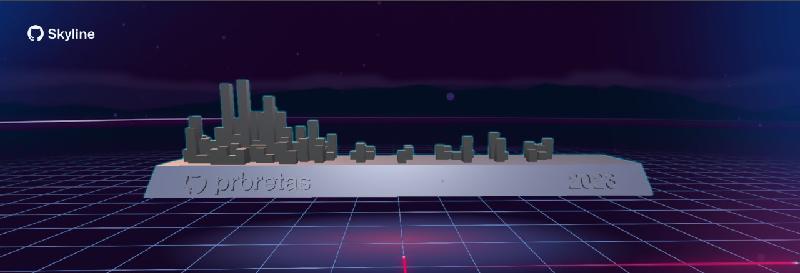

  
  
            
👋 Hey everyone! Welcome to my Github profile.
  
- 💻 I'm Developer since 2021 and I work with Logistics ERP
- 🖥️ AdvPL | JavaScript | JAVA | React Native | Springboot | SQL | 
- 🌱 I’m currently learning AdvPL, Java, SQL and others things.
- 📚 I graduated from the START Tech course by TOTVS and the DEVinHouse course at SENAI/SC.
- 📊 I'm looking to collaborate on software development, websites, webprojects, mobile and app projects.
- 📨 How to reach me: phrbretas@gmail.com

### Contact:

  
  
  
 

### Technologies and Tools

      
                                                 

   

 

 

                                                                                                                                  
### I'm learning

        
   
   

    
                             

<a href="https://github.com/prbretas">

 

  
   
   
  
  
 
