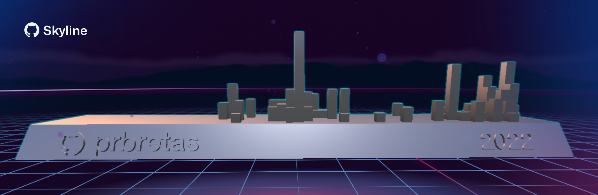
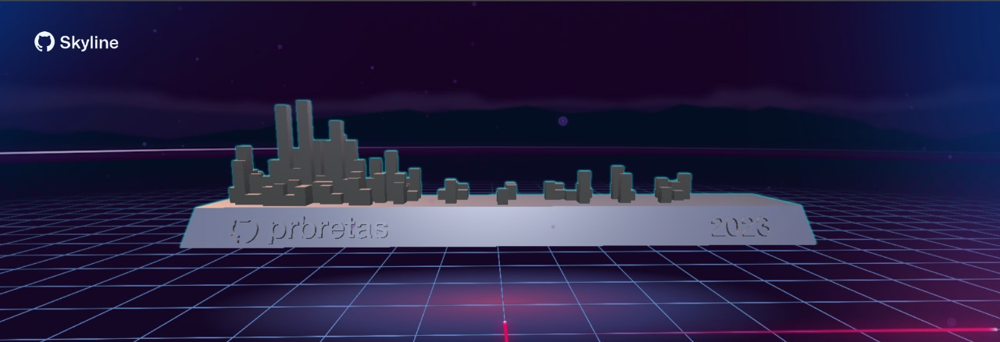

<!-- 
-->

  <h1>👋 Hey everyone! Welcome to my Github profile.</h1>
  
🚀 <strong>Desenvolvedor de Software | Técnico Analista TOTVS Protheus (GFE) | Estudante de IA</strong>

  

    
    
    
  

---

### 💻 Sobre Mim
Sou Desenvolvedor de Software com foco em soluções robustas para o ecossistema ERP e Logística. Minha atuação une a experiência em sistemas legados de alta complexidade com a implementação de fluxos modernos de Inteligência Artificial.

### 💼 Atuação Profissional & Especialidades
- **Analista TOTVS Protheus:** Domínio avançado no ecossistema Protheus, com foco total no módulo **GFE (Gestão de Frete Embarcador)**.
- **Logística e Tributação:** Certificado com o **TOTVS Badge Frete Embarcador**. Acompanho ativamente os impactos da Reforma Tributária brasileira nos processos de frete.
- **Linguagem Core:** **ADVPL** e **Progress 4GL**.
- **Desenvolvedor Full Stack:** Experiência em **JavaScript, HTML e CSS**, além de sólida base em **Java**.
- **Arquitetura de Dados:** Conhecimento intermediário em **SQL e MSSQL** para suporte e desenvolvimento de queries complexas.

### 🚀 Projetos & Estudos Atuais
- **LogPulseAI:** Ferramenta inovadora para análise de logs e stacktraces via IA (**FastAPI e LLaMA 3**) — Projeto final de especialização.
- **Engenharia Assistida por IA:** Implementação de fluxos com **GitHub Copilot e GitHub CLI** para automação de backlog, branches e Pull Requests.
- **SCTEC:** Especialização em IA para DEVs, com desenvolvimento do projeto **Portal de Gestão de Empreendimentos** para concorrer a uma vaga para o curso.
- **Projetos Externos:** Soluções técnicas para marcas como **Mente MX** (Mentoria para pilotos off-road).
- **Global Mindset:** Estudo intensivo de **Inglês** para o mercado internacional.

### 📚 Formação Técnica
- **DEVinHouse** - Fullstack (SENAI/SC)
- **START Tech** - Backend Java (TOTVS/Ada)
- **IOS** - Gestão Administrativa e Desenvolvimento WEB.

---

### 🛠 Tech Stack

   

  
  

 

---

### 📊 GitHub Stats

  
  

  

---

  

  <a href="https://github.com/prbretas">
  
  

  

